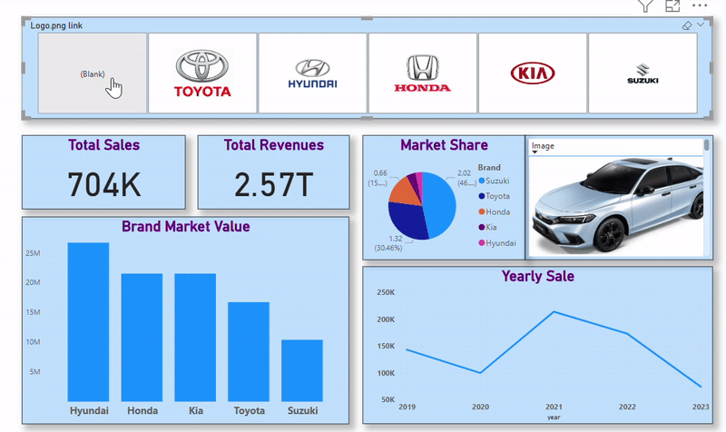

# 🚗 Car Sales Analysis Dashboard — Power BI

An interactive Power BI dashboard analyzing sales, revenue, and market performance across five major car brands: **Toyota, Hyundai, Honda, Kia, and Suzuki**.

## 📊 Overview

This dashboard lets users filter the entire report by brand (via logo-based slicers) and instantly view updated KPIs, charts, and vehicle images. Built as part of my academic coursework to practice data visualization, DAX measures, and interactive report design.

## 🔑 Features

- **Brand Filter Slicer** — Click any car logo (Toyota, Hyundai, Honda, Kia, Suzuki) to filter the entire dashboard
- **KPI Cards** — Total Sales and Total Revenue, dynamically updated per brand
- **Market Share Pie Chart** — Brand-wise market share breakdown with percentages
- **Brand Market Value Bar Chart** — Comparative market value across all five brands
- **Yearly Sales Trend** — Line chart showing sales performance from 2019–2023
- **Dynamic Vehicle Image** — Displays the corresponding car image based on the selected brand

## 🛠️ Tools & Skills Used

- **Power BI Desktop** — Report building and data modeling
- **DAX** — Custom measures for Total Sales, Total Revenue, and Market Share
- **Data Visualization** — KPI cards, pie charts, bar charts, line charts
- **Interactive Slicers** — Image-based slicer for brand filtering
- **UX/Report Design** — Clean single-page layout for quick insights

## 📈 Key Insights

- Hyundai leads in brand market value, followed closely by Kia and Honda
- 2021 marked the peak year for sales across all brands, with a decline through 2022–2023
- Toyota holds the largest market share at ~46%, followed by Hyundai at ~30%

## 📁 Files in this Repo

| File | Description |
|---|---|
| `PowerBI_Car_Sales.pbix` | Full Power BI project file (open in Power BI Desktop) |
| `dashboard_demo.gif` | Animated preview of the dashboard in action |
| `screenshot_overview.png` | Default view (no filter applied) |
| `screenshot_toyota_filter.png` | Dashboard filtered by Toyota |
| `screenshot_suzuki_filter.png` | Dashboard filtered by Suzuki |

## 🚀 How to Use

1. Download `PowerBI_Car_Sales.pbix`
2. Open it in [Power BI Desktop](https://powerbi.microsoft.com/desktop/) (free)
3. Interact with the logo slicers at the top to explore brand-specific data

## 👤 Author

**Syed Muhammad Hassan Shah**
BS Data Science, The Islamia University of Bahawalpur
[LinkedIn](https://www.linkedin.com/in/syed-muhammad-hassan-shah-b92331397/) • [GitHub](https://github.com/hassansherazi14)
